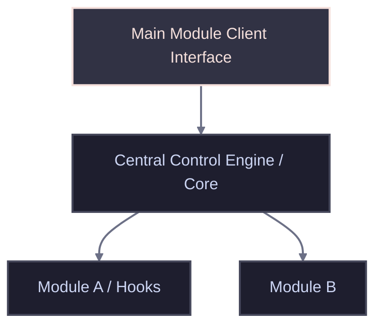

<!-- # TEMPLATE: MANUAL.template.md -->
<!--
# MANUAL
# Any text bounded by double curly braces {{like this}} is a placeholder for you to fill out.
# Replace those placeholders with real paths, rules, and project constraints.
#
# INSTRUCTIONS FOR THE AI AGENT:
# This file is the developer's handbook. It maps structural topologies, data flow,
# core algorithms, algebraic formulas, configuration guidelines, and technical specifications.
-->

<!-- markdownlint-disable MD013 -->

# MANUAL
[TOC](#toc-manual)

## 📑 AI Primary Files
[TOC](#toc-aiprimaryfiles)
- 🔹 [AGENTS.md](../AGENTS.md)
- 🔹 [ARCHIVE.md](ARCHIVE.md)
- 🔹 [BUILD.md](BUILD.md)
- 🔹 [CODE.md](CODE.md)
- 🔹 [DESIGN.md](DESIGN.md)
- 🔹 [FEATURES.md](FEATURES.md)
- 🔹 [LOG.md](LOG.md)
- 🔸 [MANUAL.md](MANUAL.md)
- 🔹 [README.md](../README.md)
- 🔹 [SPEC.md](SPEC.md)
- 🔹 [TASKS.md](TASKS.md)
- 🔹 [TERMS.md](TERMS.md)
- 🔹 [TESTING.md](TESTING.md)
- 🔹 [VERSIONS.md](VERSIONS.md)

---

<!-- TOC location -->
## 🔍 Table of Contents
<!-- Maintained by script -->
- [MANUAL](#a-manual)  ^toc-manual
  - [📑 AI Primary Files](#a-aiprimaryfiles)  ^toc-aiprimaryfiles
  - [📥 Installation & Initial Deployment](#a-installationinitialdeployment)  ^toc-installationinitialdeployment
    - [Setup Sequence](#a-setupsequence)  ^toc-setupsequence
  - [🏗️ 1. Architecture Overview](#a-1architectureoverview)  ^toc-1architectureoverview
  - [🧠 2. Core Modules & Systems](#a-2coremodulessystems)  ^toc-2coremodulessystems
  - [🔎 3. Core Algorithm & Mathematical Formulas](#a-3corealgorithmmathematicalformulas)  ^toc-3corealgorithmmathematicalformulas
  - [🛰️ 4. Commands, Keybindings & Context Flags](#a-4commandskeybindingscontextflags)  ^toc-4commandskeybindingscontextflags
  - [🔧 5. Workspace Build & Configuration](#a-5workspacebuildconfiguration)  ^toc-5workspacebuildconfiguration
  - [🔍 Diagnostics & Common Troubleshooting](#a-diagnosticscommontroubleshooting)  ^toc-diagnosticscommontroubleshooting
    - [Known Failure States & Remediations](#a-knownfailurestatesremediations)  ^toc-knownfailurestatesremediations
      - [🚨 Symptom: "The environment variable '{{CORE_ROOT}}' is not defined."](#a-symptomtheenvironmentvariablecorerootisnotdefined)  ^toc-symptomtheenvironmentvariablecorerootisnotdefined
      - [🚨 Symptom: Changes apply to files, but the visual interface does not update.](#a-symptomchangesapplytofilesbutthevisualinterfacedoesnotupdate)  ^toc-symptomchangesapplytofilesbutthevisualinterfacedoesnotupdate
  - [🚀 Go to...](#a-goto)  ^toc-goto
---
## 📥 Installation & Initial Deployment
[TOC](#toc-installationinitialdeployment)

### Setup Sequence
[TOC](#toc-setupsequence)
- 1. **Compile/Build Assets:** Run the compile script or build pipeline as documented in `BUILD.md`.
- 2. **Apply Configurations:** Run administrative scripts or system configurations required for the base application environment.
- 3. **Register Components:** Execute target registry configurations or system file bindings to link the software with the host operating system.

---

<!--
  INSTRUCTION: Outline the structural relationship of files and modules.
  Include raw ASCII boxes or diagrams to make the architecture immediately obvious.
-->
## 🏗️ 1. Architecture Overview
[TOC](#toc-1architectureoverview)

{{Detail the high-level operational lifecycle, stating what initiates, handles, and registers events}}

---

<!--
  INSTRUCTION: Document individual subsystems, class constructors, interfaces,
  and persistent background loops that govern state transitions.
-->
## 🧠 2. Core Modules & Systems
[TOC](#toc-2coremodulessystems)
- **{{System Name / e.g., Engine Compiler}}**: {{Describe internal class interfaces, global trackers, state variables, and callbacks}}
- **{{System Name / e.g., Polling Worker}}**: {{Describe loops, timing triggers, and resource consumption guards}}

---

<!--
  INSTRUCTION: Specify any underlying physical or software math calculations used.
  Represent equations cleanly in LaTeX format (e.g. $$ formula $$) with detailed variable legends.
-->
## 🔎 3. Core Algorithm & Mathematical Formulas
[TOC](#toc-3corealgorithmmathematicalformulas)
{{Describe the logical steps, logic gates, conditional switches, or core algorithm steps}}

$$\text{{{Formula Output Key}}} = \text{{{Operation}}}\left(\frac{\text{{{Var 1}}} + \text{{{Var 2}}}}{\text{{{Var 3}}}}\right)$$

- **`{{Var 1}}`**: {{Detailed explanation of variable role and default value}}
- **`{{Var 2}}`**: {{Details}}

---

<!--
  INSTRUCTION: Detail the operational command registry. This lists all binding combinations,
  modifier mappings, context filters, and background triggering gates.
-->
## 🛰️ 4. Commands, Keybindings & Context Flags
[TOC](#toc-4commandskeybindingscontextflags)
- **{{Action Title / ID}}**:
  - **Key combinations**: `{{Keys / e.g., Win+Alt+X}}`
  - **Contextual triggers**: `{{Filters list / e.g., window_class=TargetApp}}`
  - **Logical callback**: `{{Describe executed code logic}}`

---

<!--
  INSTRUCTION: Document configuration files format (.ini, .json, .env.example)
  and properties mapping. Highlight how to customize settings.
-->
## 🔧 5. Workspace Build & Configuration
[TOC](#toc-5workspacebuildconfiguration)
- **Environment Variable:** `{{CORE_ROOT}}`
  - **Purpose:** Identifies the absolute path to the main physical asset directory.
  - **Expected Format:** `{{C:\Path\To\MainDirectory}}` (No trailing backslash)
- **{{File Name / Path}}**:
  - **Configuration Section/Field**: `{{Property Name}}`
  - **Description**: {{Explain variable impact and guidelines for overriding values}}

---

## 🔍 Diagnostics & Common Troubleshooting
[TOC](#toc-diagnosticscommontroubleshooting)

---

### Known Failure States & Remediations
[TOC](#toc-knownfailurestatesremediations)

---

#### 🚨 Symptom: "The environment variable '{{CORE_ROOT}}' is not defined."
[TOC](#toc-symptomtheenvironmentvariablecorerootisnotdefined)
- **Root Cause:** The application was triggered before the system or user environment profile saved the location variable.
- **Remediation:** Run a system setup terminal command to bind the path, or manually apply it via host operating system environment parameters.

---

#### 🚨 Symptom: Changes apply to files, but the visual interface does not update.
[TOC](#toc-symptomchangesapplytofilesbutthevisualinterfacedoesnotupdate)
- **Root Cause:** The operating system shell is serving a cached variation of the directory infrastructure layout.
- **Remediation:** Re-trigger a shell refresh cycle or restart the host file architecture window manager.

---

## 🚀 Go to...
[TOC](#toc-goto)
- 🔹 [AGENTS.md](../AGENTS.md)
- 🔹 [ARCHIVE.md](ARCHIVE.md)
- 🔹 [BUILD.md](BUILD.md)
- 🔹 [CODE.md](CODE.md)
- 🔹 [DESIGN.md](DESIGN.md)
- 🔹 [FEATURES.md](FEATURES.md)
- 🔹 [LOG.md](LOG.md)
- 🔸 [MANUAL.md](MANUAL.md)
- 🔹 [README.md](../README.md)
- 🔹 [SPEC.md](SPEC.md)
- 🔹 [TASKS.md](TASKS.md)
- 🔹 [TERMS.md](TERMS.md)
- 🔹 [TESTING.md](TESTING.md)
- 🔹 [VERSIONS.md](VERSIONS.md)

<!-- # TEMPLATE: MANUAL.template.md -->
