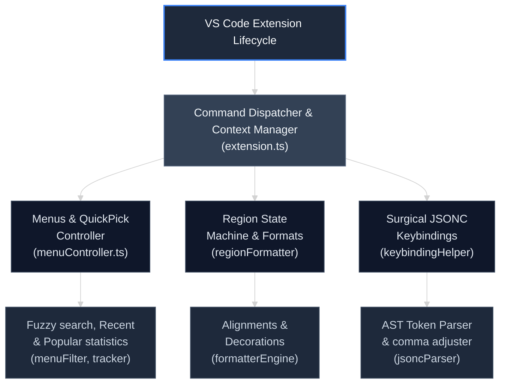

# MD-TOC

## 📑 AI Primary Files
<a id="a-aiprimaryfiles"></a>[TOC](#toc-aiprimaryfiles)
- 🔹 [AGENTS.md](../AGENTS.md) z-202607172242304501
- 🔹 [ARCHIVE.md](ARCHIVE.md)
- 🔹 [BUILD.md](BUILD.md)
- 🔹 [CODE.md](CODE.md)
- 🔹 [DESIGN.md](DESIGN.md)
- 🔹 [FEATURES.md](FEATURES.md)
- 🔹 [LOG.md](LOG.md)
- 🔹 [MANUAL.md](MANUAL.md)
- 🔹 [README.md](../README.md)
- 🔸 [SPEC.md](SPEC.md)
- 🔹 [TASKS.md](TASKS.md)
- 🔹 [TERMS.md](TERMS.md)
- 🔹 [TESTING.md](TESTING.md)
- 🔹 [VERSIONS.md](VERSIONS.md)

<!-- TOC location -->
## 🔍 Table of Contents
<!-- Maintained by script -->
- [📑 AI Primary Files](#a-aiprimaryfiles) <a id="toc-aiprimaryfiles"></a> ^toc-aiprimaryfiles
- [🔗 External Application Protocols & URI Schemes](#a-externalapplicationprotocolsurischemes) <a id="toc-externalapplicationprotocolsurischemes"></a> ^toc-externalapplicationprotocolsurischemes
- [💻 Native OS Integration Details](#a-nativeosintegrationdetails) <a id="toc-nativeosintegrationdetails"></a> ^toc-nativeosintegrationdetails
- [📋 Originally Requested Specifications](#a-originallyrequestedspecifications) <a id="toc-originallyrequestedspecifications"></a> ^toc-originallyrequestedspecifications
- [🏛️ Logical Architecture & Core Subsystems](#a-logicalarchitecturecoresubsystems) <a id="toc-logicalarchitecturecoresubsystems"></a> ^toc-logicalarchitecturecoresubsystems
- [📂 Physical Directory Layout & Codebase Registry](#a-physicaldirectorylayoutcodebaseregistry) <a id="toc-physicaldirectorylayoutcodebaseregistry"></a> ^toc-physicaldirectorylayoutcodebaseregistry
- [🔤 Glossary & Technical Vocabulary Mapping](#a-glossarytechnicalvocabularymapping) <a id="toc-glossarytechnicalvocabularymapping"></a> ^toc-glossarytechnicalvocabularymapping
- [🎯 Implemented Technical Concerns & Optimization Features](#a-implementedtechnicalconcernsoptimizationfeatures) <a id="toc-implementedtechnicalconcernsoptimizationfeatures"></a> ^toc-implementedtechnicalconcernsoptimizationfeatures
- [🚦 Internal Function Signatures & System Exit Codes](#a-internalfunctionsignaturessystemexitcodes) <a id="toc-internalfunctionsignaturessystemexitcodes"></a> ^toc-internalfunctionsignaturessystemexitcodes
- [🚀 Go to...](#a-goto) <a id="toc-goto"></a> ^toc-goto
This document compiles the user requirements and instructions from `AGENTS.md` and related files and provides detailed documentation of how the extension was architected and built.

---

## 🔗 External Application Protocols & URI Schemes
<a id="a-externalapplicationprotocolsurischemes"></a>[TOC](#toc-externalapplicationprotocolsurischemes)

### Extension Host Contract
- **Target Schema:** `vscode://` / `cursor://`
- **Query String Map:**

  | Parameter | Type | Required | Description / Constraints |
  | :--- | :--- | :--- | :--- |
  | `extensionId` | `String` | Yes | `markrobbins.ce-shard` |

---

## 💻 Native OS Integration Details
<a id="a-nativeosintegrationdetails"></a>[TOC](#toc-nativeosintegrationdetails)

### Extension Registration
- **System Hook Target:** VS Code extension directory `~/.vscode/extensions/`
- **Properties Mapping:** Matches version hashes to ensure safe runtime reloading.

---

## 📋 Originally Requested Specifications
<a id="a-originallyrequestedspecifications"></a>[TOC](#toc-originallyrequestedspecifications)
- **Dot-Path Parsing**: Resolve recursive path segments separated by dots.
- **CamelCase Abbreviations**: Generate compact abbreviations from PascalCase/camelCase word segments.
- **Squared Visual Alignment**: Align formatting blocks so they are exactly equal in line width.


### Definition of a Region's 'Name'

Initially, a region's name is defined as anything following the `#region` or `#endregion` tags.

#### Tag Name Matching Rule
- The `#region` and `#endregion` tags must always share the exact same name.
- If a discrepancy is found, the parser must favor the name on the `#region` tag and automatically correct the corresponding `#endregion` tag.

#### Graphing Eligibility Exceptions
A name is explicitly eligible to be graphed if it meets one of these two exceptions:

1. **Alpha-Numeric Dot Rule**: The name starts with an alphanumeric character (`a-zA-Z0-9`) and ends strictly with a period (`.`).
2. **Colon Escape Rule**: The name begins with a colon (`:`).


### Graphing

Graphing is the process of generating a fully qualified path based on the structural nesting of named regions.
- A name can be eligible to be graphed while remaining in its ungraphed state.
- Switching into a graphed state is completely reversible with zero loss of descriptive information.

#### Graphing Terms

- **Graph**: The entire string sequence following the region tags, which generally represents the resolved `namepath`.
- **Fragment**: A singular section of the `namepath` residing between the splitting periods (`.`).
- **Basename**: The final, trailing fragment of the resolved `namepath`.
- **Quickkey**: An abbreviated mnemonic sequence enclosed in brackets (e.g., `[ABCD]`) placed at the absolute start of a `namepath`.

### Graphing Examples

#### Example 1: Basic Eligibility
<details>
<summary style="width:100%;box-sizing:border-box;background:var(--background-secondary,#2d3139);color:var(--text-normal,#abb2bf);padding:4px 12px;font-family:monospace;font-size:12px;border-top-left-radius:4px;border-top-right-radius:4px;border-bottom:1px solid var(--border-color,#3e4452);cursor:pointer;user-select:none;">📂 THEMATIC</summary>

```thematic
// --- UNGRAPHED & INELIGIBLE ---
// #region aa
// Ineligible: Does not end with a dot.
// Basename: aa
// #endregion aa

// --- UNGRAPHED & ELIGIBLE ---
// #region aa.
// Eligible: Ends with a dot. State is currently ungraphed.
// Basename: aa
// #endregion aa.

// --- GRAPHED STATE ---
// #region aa.
// Graph state active. A single root tier looks identical to its ungraphed form.
// Basename: aa
// #endregion aa.
```

</details>

#### Example 2: Structural Nesting
<details>
<summary style="width:100%;box-sizing:border-box;background:var(--background-secondary,#2d3139);color:var(--text-normal,#abb2bf);padding:4px 12px;font-family:monospace;font-size:12px;border-top-left-radius:4px;border-top-right-radius:4px;border-bottom:1px solid var(--border-color,#3e4452);cursor:pointer;user-select:none;">📂 THEMATIC</summary>

```thematic
// --- UNGRAPHED ---
// #region aa.
// Basename: aa

//   #region inner.
//   Basename: inner
//   #endregion inner.

// #endregion aa.

// --- GRAPHED ---
// #region aa.
// Basename: aa

//   #region aa.inner.
//   Graphed State: Inherits parent path prefix
//   Basename: inner
//   #endregion aa.inner.

// #endregion aa.
```

</details>

#### Example 3: Escaping Fields with Periods
<details>
<summary style="width:100%;box-sizing:border-box;background:var(--background-secondary,#2d3139);color:var(--text-normal,#abb2bf);padding:4px 12px;font-family:monospace;font-size:12px;border-top-left-radius:4px;border-top-right-radius:4px;border-bottom:1px solid var(--border-color,#3e4452);cursor:pointer;user-select:none;">📂 THEMATIC</summary>

```thematic
// --- UNGRAPHED (Ineligible Syntax) ---
// #region aa.
// #region i want to use '.' in this name.
// Broken: The internal dot breaks standard fragment parsing.
// #endregion i want to use '.' in this name.
// #endregion aa.

// --- UNGRAPHED ESCAPED (Eligible via Colon) ---
// #region aa.
// #region :i want to use '.' in this name.
// Eligible: Starts with a colon.
// Basename: i want to use '.' in this name
// Note: Intended to act as a terminal leaf.
// #endregion i want to use '.' in this name.
// #endregion aa.

// --- GRAPHED STATE (Converted to Quotes) ---
// #region aa.
// #region aa."i want to use '.' in this name."
// Graphed: The colon converts to enclosing double quotes.
// Basename: i want to use '.' in this name
// #endregion i want to use '.' in this name.
// #endregion aa.
```

</details>

### Quickkey Definition

Given a text-based `namepath`, a shorthand sequence is generated to form a quickkey prefix.

#### Core Examples
Given the raw `namepath`:
`a.b c.d`

The derived quickkey is:
`[ABCD]`

#### Transformation Matrix

| Namepath | Quickkey | Details / Edge Cases |
| :--- | :--- | :--- |
| `a.camelCaseWierd abc.` | `ACcwA` | Captures inner CamelCase boundaries (`C`, `c`, `w`) along with word starts. |
| `a."any text".c` | `A_C` | Multi-word quoted sequences collapse down to a literal fallback underscore `_`. |

### Deep Dive: The Colon Rule

Using nested children beneath an escaped colon/quoted region is considered bad design architecture, though the syntax parser will resolve it.

```thematic
// --- UNGRAPHED STATE ---
// #region aa.
// #region :i want to use '.' in this name.
// Basename: i want to use '.' in this name

//     #region cc.
//     Warning: Bad practice. Parent is intended to be a leaf node.
//     #endregion cc.

// #endregion :i want to use '.' in this name.
// #endregion aa.

// --- GRAPHED STATE ---
// #region aa.
// #region aa."i want to use '.' in this name"
// Basename: i want to use '.' in this name
// Quickkey character resolved to: _

//     #region aa."i want to use '.' in this name".cc.
//     Parsed: Parent resolving is completed but structures are volatile.
//     #endregion aa."i want to use '.' in this name".cc.

// #endregion aa."i want to use '.' in this name"
// #endregion aa.
```
### Formatting

Formatting describes the explicit pipeline of toggling a region into or out of its graphed state. There are four distinct operational formatting levels.

#### Graph Format Tiers
- **None**: The raw, default state. Often referred to as the short form.
- **Short**: Graphing rules apply exclusively to the generation of `quickkeys`.
- **Medium**: The full path structure is graphed, but all `quickkeys` are omitted.
- **Long**: Full path structuring and `quickkeys` are completely generated and graphed.

#### Format Control Codes
You can pass strict modifiers as the absolute first character of a region name. These codes forcefully block or override global environment format rules for that specific region tier and all downstream nested descendants.

| Code | Format Level | Behavior |
| :---: | :--- | :--- |
| `!` | None | Explicitly forces raw presentation. Prevents graphing entirely. |
| `-` | Short | Forces only quickkeys to undergo graphing transformation. |
| `_` | Medium | Forces full path graphing while hiding quickkey tags. |
| `+` | Long | Forces complete output (Full nested paths + Quickkey tags). |

*Note: If an explicit child descendant defines its own code tag, it completely overrides the inheritance rule passed down by its parent node.*

---
### Predictive Shortkey Matrix Navigation Specification

This document details the functional specification for an implicit, dual-mode command palette controller. It provides users with lightning-fast, zero-overhead shortcuts by defaulting to an aggressive, positional acronym-matching engine (Strict Quickkey Mode), while gracefully degrading to standard text matching (Fuzzy Fallback Mode) if the structural pattern is broken.

---

### Core Mechanics & User Experience Architecture

[ User Input Field: "gri" ] ──► Matches "grir", "grimc", etc.
├── YES (Prefix Valid) ──► Mode: [STRICT] ──► Render Clean Titles
│   └── Update Status Bar with Next Valid Keys
│
└── NO (Pattern Broken) ──► Mode: [FUZZY]  ──► Fallback to Substring Search
└── Alert User via Status Update

1. **Implicit Quickkey Focus**: The user does not need to enter a special character (like `!` or `[`) to trigger shortcuts. The system treats the beginning of the text string as the absolute start of a positional quickkey sequence.
2. **Hidden Structural Mnemonic**: The interface stays clean and minimalist. Macro titles do not display distracting bracket codes (e.g., `[GRiR]`). Instead, the quickkey matches against a hidden metadata property on the back-end payload.
3. **Live Status Bar Prediction**: As long as the input string matches a valid structural path prefix, the system calculates all possible branching paths and surfaces the next legal character options directly in the workspace status bar.
4. **Failsafe Fuzzy Degradation**: The moment a user types a character that does not align with the next structural slot options, the state machine instantly flips into a standard substring search. This ensures users who don't know the shortcuts can still search naturally using human language without encountering an error.

---
### System Understanding & Matrix Logic

The matrix defines a **7-slot decision pipeline** where choices cascade down to defaults if the user selects the wildcard placeholder (`_`). Slots 2 and 4 are **conditional scopes** evaluated dynamically based on the state of slots 1 and 3 respectively.

- Slot 1: Action        -> (_ | go | new | wrap | dupe | select | copy | xtract | rename | zap | peel | move | union | import)
- Slot 2: Target Scope  -> If Action in [go, new, wrap, dupe, select, copy, xtract, zap, move, union, import] -> (_ | region | contents) else Skip
- Slot 3: Selector      -> (_ | indicated | first | last | next | prev | current)
- Slot 4: Multiplicity  -> If Selector == indicated -> (_ | one | many) else Skip
- Slot 5: Hierarchy     -> (_ | root | ancestor | brother | child | decendent | edge | fragment | graph | higher | index | lower)
- Slot 6: Visibility    -> (_ | there | visible | hidden)
- Slot 7: Fold State    -> (_ | any | folded | unfolded)

### Matrix Grammar Structural Terminology Docs

This document provides the analytical definition and runtime behavior mapping for each structural term utilized inside the multi-stage positional grammar parser matrix.

---

### Slot 1: Actions (Execution Intent)
Defines the primary structural operation to execute on the targeted text scope.

- **go**: Relocates the active text editor cursor position directly to the target area.
- **new**: Instantiates an entirely empty container area block inside the text document buffer.
- **wrap**: Encapsulates the currently highlighted text inside a newly declared container block.
- **dupe**: Clones the targeted structure and replicates its contents on a new offset layout line.
- **select**: Programmatically targets and highlights the selected region using the core visual text editor selection boundary.
- **copy**: Pipelines the character contents of the matched region directly to the operating system's global clipboard buffer.
- **xtract**: Removes text content from the target region, replacing it with an anchor reference, and relocates the source text content elsewhere.
- **rename**: Mounts an inline multi-cursor edit session to rewrite the metadata identifier tag name of the matched region.
- **zap**: Destructive action. Purges both the targeted enclosing region boundaries and all character bytes trapped inside it.
- **peel**: Safely strips away the enclosing outer region tags/boundaries while preserving the inner child text blocks untouched.
- **move**: Relocates the physical layout position of the target structural block higher or lower relative to adjacent syntax nodes.
- **union**: Merges two separate target regions into a singular unified multi-range or sequential block element.
- **import**: Dynamically reads or injects external configuration data or foreign schema structures directly into the target area block.

---

### Slot 2: Target Scopes (Structural Boundaries)
Determines whether operations apply to structural frames or the pure text payload.

- **region**: Modifies or evaluates the physical structure frame, structural metadata tag properties, or surrounding container syntax limits.
- **contents**: Targets only the pure inner data payload or nested text lines enclosed by the boundary, completely ignoring the structural tags themselves.

---

### Slot 3: Selectors (Positional Directives)
Establishes the geometric search vectors relative to the active editor cursor position.

- **indicated**: Targets structures explicitly highlighted, hovered over, or pinpointed by active UI components.
- **first**: Queries the absolute top-most or index-0 structure entry located within the parent document workspace.
- **last**: Queries the absolute bottom-most or final terminal entry located within the parent document workspace.
- **next**: Scans sequentially downwards to catch the nearest sibling structure following the current cursor row line.
- **prev**: Scans sequentially upwards to catch the nearest sibling structure preceding the current cursor row line.
- **current**: Targets the structural container area currently housing the active text editor cursor position.

---

### Slot 4: Multiplicities (Target Quantifiers)
Defines target array dimensions when using an explicit `indicated` pointer strategy.

- **one**: Limits the matching pipeline evaluation logic to resolve exactly one discrete node element.
- **many**: Expands execution to target an array of all matching metadata structures found within the target window bounds.

---

### Slot 5: Hierarchies (Relational Node Graphs)
Calculates tree traversal directions relative to the primary node match.

- **root**: Bypasses local context to target the top-level structural ancestor bounding the entire syntax tree column.
- **ancestor**: Traverses standard tree nodes vertically upwards to map containing parent wrappers.
- **brother**: Traverses horizontally along the same tree depth level to map immediate sibling blocks.
- **child**: Steps down exactly one structural depth level layer to evaluate immediate sub-elements.
- **decendent**: Evaluates all deeply recursive sub-elements, regardless of depth level layers beneath the current block.
- **edge**: Targets structural boundary limits, margins, tags, or leading/trailing framing delimiters of the match.
- **fragment**: Isolates individual sub-strings or broken code snippets within a partially compiled or unclosed block layout.
- **graph**: Captures and processes the entire relational topological map configuration of the target block and its links.
- **higher**: Traverses lines upward to parse regions containing a smaller structural nest index number.
- **index**: Directly targets a static structural matching location calculated via a fixed integer index configuration parameter.
- **lower**: Traverses lines downward to parse regions containing a larger structural nest index number.

---

### Slot 6: Visibilities (Viewport Workspace Rendering States)
Filters structural targets based on workspace layout coordinates.

- **there**: A flexible default indicating structural presence within the active document text buffer space.
- **visible**: Filters selections to target only code characters actively displayed inside the user's viewport screen view.
- **hidden**: Restricts the selection engine to target only elements scrolled out of view or masked from display layouts.

---

### Slot 7: Fold States (Editor Layout Conditions)
Filters target nodes based on code block collapse configuration states.

- **any**: Ignores code folding states entirely, processing matches across both expanded and collapsed code lines.
- **folded**: Targets only structures whose inner code loops or lines are currently collapsed/hidden by the editor layout mechanism.
- **unfolded**: Targets only structures whose inner content lines are expanded and completely readable within the active workspace document.


### Implementation Specification

Below is the complete TypeScript implementation for the VS Code Extension API. It maps the cascading fallback matrices, maintains state across dynamic step changes, tracks the title-bar breadcrumbs, and instantly terminates into execution when `_` is confirmed.

```typescript
import * as vscode from 'vscode';

// ============================================================================
// 1. TYPE DEFINITIONS & MATRIX GRAMMAR CONFIGURATION
// ============================================================================

type MatrixState = {
    action: string;
    scope: string | null; // Null if skipped due to conditional grammar
    selector: string;
    multiplicity: string | null; // Null if skipped due to conditional grammar
    hierarchy: string;
    visibility: string;
    foldState: string;
};

// Define explicit ordered options. The first element index represents the structural system default.
const MATRIX_GRAMMAR = {
    actions: ['go', 'new', 'wrap', 'dupe', 'select', 'copy', 'xtract', 'rename', 'zap', 'peel', 'move', 'union', 'import'],
    scopes: ['region', 'contents'],
    selectors: ['indicated', 'first', 'last', 'next', 'prev', 'current'],
    multiplicities: ['one', 'many'],
    hierarchies: ['root', 'ancestor', 'brother', 'child', 'decendent', 'edge', 'fragment', 'graph', 'higher', 'index', 'lower'],
    visibilities: ['there', 'visible', 'hidden'],
    folds: ['any', 'folded', 'unfolded']
};

// Conditional Logic Gates
function requiresScope(action: string): boolean {
    const triggers = ['go', 'new', 'wrap', 'dupe', 'select', 'copy', 'xtract', 'zap', 'move', 'union', 'import'];
    return triggers.includes(action);
}

function requiresMultiplicity(selector: string): boolean {
    return selector === 'indicated';
}

// ============================================================================
// 2. MAIN WIZARD ORCHESTRATOR
// ============================================================================

export async function launchRegionMatrixPicker() {
    // Structural runtime configuration state
    let state: MatrixState = {
        action: MATRIX_GRAMMAR.actions[0],
        scope: null,
        selector: MATRIX_GRAMMAR.selectors[0],
        multiplicity: null,
        hierarchy: MATRIX_GRAMMAR.hierarchies[0],
        visibility: MATRIX_GRAMMAR.visibilities[0],
        foldState: MATRIX_GRAMMAR.folds[0]
    };

    // Explicitly align scope/multiplicity switches based on absolute initial root defaults
    if (requiresScope(state.action)) state.scope = MATRIX_GRAMMAR.scopes[0];
    if (requiresMultiplicity(state.selector)) state.multiplicity = MATRIX_GRAMMAR.multiplicities[0];

    // Execution sequence tracking array
    const steps: string[] = ['action'];
    let stepIndex = 0;

    // Build the initial full path sequence map before running loop
    recalculateStepSequence(steps, state);

    while (stepIndex < steps.length) {
        const currentStep = steps[stepIndex];
        const result = await renderStepPicker(currentStep, state);

        if (result === undefined) {
            // User aborted the UI via Escape key
            return;
        }

        if (result.isDefaultCascade) {
            // Instant termination path: Accept defaults all the way down from here
            executeMatrixCommand(state);
            return;
        }

        // Commit chosen state value back to structural matrix data layer
        updateStateValue(currentStep, result.value, state);

        // Dynamically compute the precise next step map based on current node updates
        recalculateStepSequence(steps, state);
        stepIndex++;
    }

    // Finished processing all interactive steps cleanly
    executeMatrixCommand(state);
}

// ============================================================================
// 3. QUICKPICK INTERACTION RENDER ENGINE
// ============================================================================

interface PickerResult {
    value: string;
    isDefaultCascade: boolean;
}

function renderStepPicker(step: string, state: MatrixState): Promise<PickerResult | undefined> {
    return new Promise((resolve) => {
        const quickPick = vscode.window.createQuickPick();

        // Dynamically build the stylized uppercase/lowercase header title breadcrumb string
        quickPick.title = generateTitleBreadcrumb(step, state);
        quickPick.placeholder = `Select option or choose '_' to accept cascading defaults`;
        quickPick.ignoreFocusOut = true;

        // Collect string lists allocated to active target enum range
        const rawOptions = getOptionsForStep(step);

        const items: vscode.QuickPickItem[] = [
            {
                label: '_',
                description: `< accept then exec command: ${compileFinalCommandString(state, true, step)}`,
                alwaysShow: true
            },
            {
                label: 'Choices',
                kind: vscode.QuickPickItemKind.Separator
            },
            ...rawOptions.map(opt => ({ label: opt }))
        ];

        quickPick.items = items;

        quickPick.onDidAccept(() => {
            const selected = quickPick.selectedItems[0];
            quickPick.dispose();

            if (!selected) {
                resolve(undefined);
                return;
            }

            if (selected.label === '_') {
                resolve({ value: '_', isDefaultCascade: true });
            } else {
                resolve({ value: selected.label, isDefaultCascade: false });
            }
        });

        quickPick.onDidHide(() => {
            quickPick.dispose();
            resolve(undefined);
        });

        quickPick.show();
    });
}

// ============================================================================
// 4. METADATA STRING COMPILERS & FORMATTERS
// ============================================================================

function generateTitleBreadcrumb(activeStep: string, state: MatrixState): string {
    const parts: string[] = [];

    // Helper formatter to match capitalisation rules based on step status
    const formatSegment = (stepName: string, value: string | null) => {
        if (value === null) return;
        parts.push(activeStep === stepName ? value.toLowerCase() : value.toUpperCase());
    };

    formatSegment('action', state.action);
    formatSegment('scope', state.scope);
    formatSegment('selector', state.selector);
    formatSegment('multiplicity', state.multiplicity);
    formatSegment('hierarchy', state.hierarchy);
    formatSegment('visibility', state.visibility);
    formatSegment('foldState', state.foldState);

    return parts.join(' ');
}

function compileFinalCommandString(state: MatrixState, useDefaultsForRemaining: boolean = false, currentStep: string = ''): string {
    const parts: string[] = [];
    const stepsOrder = ['action', 'scope', 'selector', 'multiplicity', 'hierarchy', 'visibility', 'foldState'];
    const activeIndex = stepsOrder.indexOf(currentStep);

    const resolveValue = (stepName: string, currentValue: string | null, pool: string[]) => {
        if (currentValue === null) return null;
        if (useDefaultsForRemaining && stepsOrder.indexOf(stepName) >= activeIndex) {
            return pool[0]; // Fallback to index absolute default structural value
        }
        return currentValue;
    };

    const act = resolveValue('action', state.action, MATRIX_GRAMMAR.actions);
    if (act) parts.push(act);

    // Conditional evaluation constraints for previewing string
    if (act && requiresScope(act)) {
        const scp = resolveValue('scope', state.scope, MATRIX_GRAMMAR.scopes);
        if (scp) parts.push(scp);
    }

    const sel = resolveValue('selector', state.selector, MATRIX_GRAMMAR.selectors);
    if (sel) {
        parts.push(sel);
        if (requiresMultiplicity(sel)) {
            const mult = resolveValue('multiplicity', state.multiplicity, MATRIX_GRAMMAR.multiplicities);
            if (mult) parts.push(mult);
        }
    }

    const hie = resolveValue('hierarchy', state.hierarchy, MATRIX_GRAMMAR.hierarchies);
    if (hie) parts.push(hie);

    const vis = resolveValue('visibility', state.visibility, MATRIX_GRAMMAR.visibilities);
    if (vis) parts.push(vis);

    const fld = resolveValue('foldState', state.foldState, MATRIX_GRAMMAR.folds);
    if (fld) parts.push(fld);

    return parts.join(' ');
}

// ============================================================================
// 5. DATA ENGINE STATE UTILITIES
// ============================================================================

function getOptionsForStep(step: string): string[] {
    switch (step) {
        case 'action':       return MATRIX_GRAMMAR.actions;
        case 'scope':        return MATRIX_GRAMMAR.scopes;
        case 'selector':     return MATRIX_GRAMMAR.selectors;
        case 'multiplicity': return MATRIX_GRAMMAR.multiplicities;
        case 'hierarchy':    return MATRIX_GRAMMAR.hierarchies;
        case 'visibility':   return MATRIX_GRAMMAR.visibilities;
        case 'foldState':    return MATRIX_GRAMMAR.folds;
        default:             return [];
    }
}

function updateStateValue(step: string, value: string, state: MatrixState) {
    switch (step) {
        case 'action':       state.action = value; break;
        case 'scope':        state.scope = value; break;
        case 'selector':     state.selector = value; break;
        case 'multiplicity': state.multiplicity = value; break;
        case 'hierarchy':    state.hierarchy = value; break;
        case 'visibility':   state.visibility = value; break;
        case 'foldState':    state.foldState = value; break;
    }
}

function recalculateStepSequence(steps: string[], state: MatrixState) {
    // Reset core sequential baseline
    steps.length = 0;
    steps.push('action');

    if (requiresScope(state.action)) {
        if (state.scope === null) state.scope = MATRIX_GRAMMAR.scopes[0];
        steps.push('scope');
    } else {
        state.scope = null; // Purge path value safely
    }

    steps.push('selector');

    if (requiresMultiplicity(state.selector)) {
        if (state.multiplicity === null) state.multiplicity = MATRIX_GRAMMAR.multiplicities[0];
        steps.push('multiplicity');
    } else {
        state.multiplicity = null; // Purge path value safely
    }

    steps.push('hierarchy', 'visibility', 'foldState');
}


```


---

### TypeScript Data & Component Design

#### 1. Contract Models

```typescript
export interface MacroItem {
    id: string;        // System key identifier, e.g., "shard.go_region_indicated_one_root_there_any"
    title: string;     // Pristine presentation title, e.g., "GO REGION -> indicated ROOT"
    quickkey: string;  // Compact search metadata representation, e.g., "grir"
    cat: string;       // Categorization grouping tag, e.g., "Macros"
    key: string;       // Static keyboard shortcut slot if pre-bound
}

export interface MatchingResult {
    items: MacroItem[];
    mode: "STRICT" | "FUZZY";
}
```

#### 2. The State Engine Blueprint

```typescript
export class PredictiveMatrixEngine {
    /**
     * Evaluates the current filtered subset of macros to determine which
     * characters can legally be typed next according to structural slots.
     */
    public getNextValidKeys(query: string, currentFilteredItems: MacroItem[]): string[] {
        const queryLen = query.length;
        const validNextChars = new Set<string>();

        currentFilteredItems.forEach(item => {
            // Check if the item's hidden quickkey matches the current input prefix
            if (item.quickkey.toLowerCase().startsWith(query.toLowerCase())) {
                if (queryLen < item.quickkey.length) {
                    const nextChar = item.quickkey[queryLen].toUpperCase();
                    validNextChars.add(nextChar);
                }
            }
        });

        return Array.from(validNextChars).sort();
    }

    /**
     * Dual-Mode Evaluation Routing Core. Matches strictly against
     * quickkey metadata prefixes first, falling back smoothly to fuzzy search text match on failure.
     */
    public evaluateInput(query: string, allItems: MacroItem[]): MatchingResult {
        const cleanQuery = query.trim().toLowerCase();

        if (!cleanQuery) {
            return { items: allItems, mode: "STRICT" };
        }

        // Phase 1: Attempt to process input string as a positional acronym track
        const strictMatches = allItems.filter(item =>
            item.quickkey.toLowerCase().startsWith(cleanQuery)
        );

        if (strictMatches.length > 0) {
            return { items: strictMatches, mode: "STRICT" };
        }

        // Phase 2: Escape and fallback to standard content scanning
        const fuzzyMatches = allItems.filter(item =>
            item.title.toLowerCase().includes(cleanQuery)
        );

        return { items: fuzzyMatches, mode: "FUZZY" };
    }
}
```

---

### Step-by-Step Interactive Workflow Examples

Below are standard interaction flows demonstrating how the UI components, input loops, and status panels coordinate states seamlessly.

#### Workflow A: The High-Speed Structural Stream (Intentional Quickkey)

| User Actions | Computed Input State | Active Engine Mode | Filtered UI Results | Live Status Bar Notification |
| :--- | :--- | :---: | :--- | :--- |
| **0. Invokes Menu** | `""` | `STRICT` | Displays all 4,158 macro items | `⚡ Go New Select Copy Xtract Dupe Zap Peel Move` |
| **1. Types `g`** | `"g"` | `STRICT` | Filters to options beginning with `GO` | `⚡ Go : Contents Region` |
| **2. Types `r`** | `"gr"` | `STRICT` | Filters down strictly to `GO REGION...` | `⚡ Go Region : Indicated First Last Next Prev Current` |
| **3. Types `i`** | `"gri"` | `STRICT` | Filters down to `GO REGION -> indicated...` | `⚡ Go Region Indicated : Root Ancestor Brother Child Decendent Edge Fragment Graph Higher Index Lower` |
| **4. Types `m`** | `"grim"` | `STRICT` | Locks onto multi-target `[MANY]` paths | `⚡ Go Region Indicated Many : Root Ancestor Brother Child Decendent Edge Fragment Graph Higher Index Lower` |

#### Workflow B: The Search-Fallback Transition (Human Language Input)

| User Actions | Computed Input State | Active Engine Mode | Filtered UI Results | Live Status Bar Notification |
| :--- | :--- | :---: | :--- | :--- |
| **0. Invokes Menu** | `""` | `STRICT` | Displays all 4,158 macro items | `⚡ Go New Select Copy Xtract Dupe Zap Peel Move` |
| **1. Types `z`** | `"z"` | `STRICT` | Isolates all `ZAP` actions | `⚡ Zap : Contents Region` |
| **2. Types `a`** | `"za"` | `FUZZY` | Evaluates string title content loosely | `⚠️ Broken pattern sequence. Swapped into loose search text matching.` |
| **3. Types `p`** | `"zap"` | `FUZZY` | Displays all `ZAP` related entries | `⚠️ Broken pattern sequence. Swapped into loose search text matching.` |
| **4. Adds `hidden`**| `"zap hidden"` | `FUZZY` | Matches any title with "zap" and "hidden" | `⚠️ Broken pattern sequence. Swapped into loose search text matching.` |


---

### Universal Matrix Interface Specification: Menu Systems & Region Pickers

This specification extends the predictive, dual-mode matrix interface design to the extension's core **Navigation Menus** and the **Active Region Picker**. Every step across all interfaces uses uncluttered, title-case words where the first letter is the immediate shortcut key.

---

### 1. Extension Main Menu System
The primary entry menu maps administrative commands, global settings changes, and formatting levels using the exact same predictive, strict-to-fuzzy lifecycle.

#### Active States & Option Mappings
- **Root Choices**: `[C] Commands` | `[F] Formatting` | `[S] Settings` | `[V] View`
- **Formatting Sub-Menu**: `[N] None` | `[S] Short` | `[M] Medium` | `[L] Long`
- **Settings Sub-Menu**: `[D] Defaults` | `[K] Keybindings` | `[P] Preferences`

#### Menu Interaction Matrix

| User Actions | Input State | Active Mode | Filtered UI Results | Live Status Bar Notification |
| :--- | :--- | :---: | :--- | :--- |
| **0. Opens Menu** | `""` | `STRICT` | Displays root menu items | `⚡ Commands Formatting Settings View` |
| **1. Types `f`** | `"f"` | `STRICT` | Isolates formatting commands | `⚡ Formatting : None Short Medium Long` |
| **2. Types `m`** | `"fm"` | `STRICT` | Locks to Medium global format | `⚡ Formatting Medium : Executed successfully` |
| **3. Types `x` (Failsafe)**| `"fmx"` | `FUZZY` | Falls back to loose text search | `⚠️ Broken pattern sequence. Swapped into loose search text matching.` |

[Level 1: Root Node Name] ──► [Level 2: Child Node Name] ──► [Level 3: Operational Flags]

- **Operational Flags**: `[F] Folded` | `[U] Unfolded` | `[V] Visible` | `[H] Hidden`

#### Region Picker Interaction Matrix

Assuming a workspace containing an active document structure with nested paths like `App.Components.Header`:

| User Actions | Input State | Active Mode | Filtered UI Results | Live Status Bar Notification |
| :--- | :--- | :---: | :--- | :--- |
| **0. Opens Picker** | `""` | `STRICT` | Lists all root-level code regions | `⚡ App Base Core Config Utils` |
| **1. Types `a`** | `"a"` | `STRICT` | Focuses strictly on `App` scope | `⚡ App : Components Layout Services` |
| **2. Types `c`** | `"ac"` | `STRICT` | Dives deep into `App.Components` | `⚡ App Components : Footer Header Sidebar` |
| **3. Types `h`** | `"ach"` | `STRICT` | Locks path to `App.Components.Header` | `⚡ App Components Header : Folded Unfolded Visible Hidden` |
| **4. Types `f`** | `"achf"` | `STRICT` | Targets only the folded block elements | `⚡ App Components Header Folded : Jumper active` |

---

### 3. Integrated State Machinery Implementation

This unified class maps short key paths down to clear, predictive strings for the status row across all structural types.

```typescript
export interface SlotDictionary {
    [key: string]: string; // Maps 'g' -> 'Go', 'r' -> 'Region', etc.
}

export class UniversalMatrixPresenter {
    private readonly masterDictionary: SlotDictionary = {
        // Actions
        g: "Go", n: "New", s: "Select", c: "Copy", x: "Xtract", d: "Dupe", z: "Zap", p: "Peel", m: "Move",
        // Targets
        r: "Region", o: "Contents",
        // Modifiers
        i: "Indicated", f: "First", l: "Last", e: "Next", v: "Prev", u: "Current",
        // Scopes & Flags
        a: "Ancestor", b: "Brother", h: "Child", y: "Many", t: "There", w: "Unfolded"
    };

    /**
     * Converts a typed acronym query string into an uncluttered title-case status chain.
     */
    public buildStatusBarString(query: string, validNextChars: string[]): string {
        const cleanQuery = query.trim().toLowerCase();
        const steps: string[] = [];

        // 1. Resolve past steps typed so far
        for (const char of cleanQuery) {
            const word = this.masterDictionary[char] || char.toUpperCase();
            steps.push(word);
        }

        // 2. Resolve immediate future possibilities
        const nextWords = validNextChars.map(char => {
            const lowerChar = char.toLowerCase();
            return this.masterDictionary[lowerChar] || char.toUpperCase();
        });

        // 3. Assemble clean structural chain output
        const prefixChain = steps.join(" ");
        const suffixOptions = nextWords.join(" ");

        if (prefixChain && suffixOptions) {
            return `⚡ ${prefixChain} : ${suffixOptions}`;
        } else if (prefixChain) {
            return `⚡ ${prefixChain}`;
        }

        return `⚡ ${suffixOptions}`;
    }
}
```


---

### 2. Active Region Picker
The Region Picker allows real-time code navigation by rendering parsed, nested `#region` paths dynamically. It supports stepping down deeper layers or filtering by active flags.

#### Structural Slot Layout
Instead of using static preset lists, the picker interrogates the active text document at runtime to extract and build a dynamic topological tree of current code regions.

- **Level-by-Level Navigation**: Maps nested structures into hierarchical tiers (e.g., `App.Components.Header`). Selecting a parent path dynamically scopes the picker options to its immediate nested child branches, minimizing viewport clutter.
- **Dynamic Quickkeys**: Generates positional letters on-the-fly for each child block to ensure seamless single-character keyboard navigation.
- **Operational Status Filters**: Incorporates state-filtering tags at the absolute terminal boundary of the picker flow:
  - `[F] Folded` - Filters to and targets only regions whose code block folds are currently collapsed in the editor layout.
  - `[U] Unfolded` - Targets active regions whose inner code loops are fully expanded.
  - `[V] Visible` - Restricts view to target elements actively scrolled into the user's visual frame.
  - `[H] Hidden` - Scours regions residing in lines scrolled out of view.
- **Execution Target (Go To)**: Once a target is pinpointed, the editor cursor is instantly relocated to the starting line coordinates of the matching `#region` tag.

---

## 🏛️ Logical Architecture & Core Subsystems
<a id="a-logicalarchitecturecoresubsystems"></a>[TOC](#toc-logicalarchitecturecoresubsystems)

The **Sector Hub Axis Region Diktat (SDP)** is built on six core decoupled subsystems that synchronize through well-defined interfaces and reactive context flags:




### 1. Command Dispatcher & Keyboard Context Manager
This entry subsystem handles command registration, global context flags, and editor event triggers:
- **Registration**: Registered in [../src/extension.ts](../src/extension.ts), dynamically binding execution handlers for all 12 toggles, clipboard actions, formatting engines, and verification runs.
- **Context Monitoring**: Manipulates `setContext` indicators like `shard.keybindingsEnabled` (suspends chord execution to prevent key overrides) and `shardTakesBackspace` (controls whether backspace navigates backward in the menu hierarchy).
- **Status Indicator**: Drives the `shardBSStatusBarItem` status bar widget which updates reactively to display `🟢 Shard BS` or `🔴 Shard BS` reflecting active state changes.

### 2. Predictive QuickPick Menus & Search Routing
This subsystem displays user options and maps acronym searches to commands:
- **Schema Driver**: Driven by the Single Source of Truth (SSOT) schema [../src/menus/menuSpec.ts](../src/menus/menuSpec.ts) which defines hierarchical levels and metadata tags.
- **Interaction Controller**: Managed by [../src/menus/menuController.ts](../src/menus/menuController.ts) and [../src/menus/menuEngine.ts](../src/menus/menuEngine.ts) to render native QuickPick interfaces with custom breadcrumb titles and back navigation.
- **Dual-Mode Filtering**: Employs [../src/menus/menuFilter.ts](../src/menus/menuFilter.ts) to enforce Strict Quickkey Mode (matches positional prefix shortcuts and updates status bars with next legal characters) before falling back to Fuzzy Mode on pattern mismatches.
- **Metrics Tracker**: Integrates [../src/utils/tracker.ts](../src/utils/tracker.ts) to track execution metrics, sorting command lists dynamically by Popularity and Recency.

### 3. Hierarchical Region State Machine & Formatting Engines
This subsystem parses documents and aligns comments mathematically:
- **Orchestrator**: Directed by [../src/regionFormatter.ts](../src/regionFormatter.ts) which handles selection scanning and applies resulting edits as single-transaction `vscode.TextEdit` arrays.
- **Hierarchical Region State Machine**: Implemented inside [../src/engines/formatterEngine.ts](../src/engines/formatterEngine.ts). Evaluates text line-by-line using custom regexes generated by [../src/utils/regex.ts](../src/utils/regex.ts) to track nesting structures inside a context stack.
- **CamelCase Abbreviation**: Computes compact shortcuts (e.g., `AppEngine` -> `AE`, `database` -> `DAT`) via the `parsePathAndAbbreviate` subroutine.
- **Padded Layout Margins**: Right-pads region comment strings with fill characters to match the configured target column width.

### 4. Highlighting & Visual Token Decorators
This subsystem provides micro-feedback directly in the editor viewport:
- **Visual Highlighter**: Managed by [../src/engines/decoratorEngine.ts](../src/engines/decoratorEngine.ts). It monitors document modifications and active editor switches.
- **Thematic Colors**: Parses start and end tags in the active viewport and applies configured styling decorators, mapping colors dynamically based on `shard.regionStartTokenColor` and `shard.regionEndTokenColor`.

### 5. Surgical Keybindings & JSONC Manipulation
This subsystem modifies global configurations safely without altering user profiles:
- **Ast-Preserving Tokenizer**: Employs [../src/utils/jsoncParser.ts](../src/utils/jsoncParser.ts) to parse JSONC configurations into structured node trees that retain comments.
- **Selective Injection**: Uses [../src/utils/jsoncRebuilder.ts](../src/utils/jsoncRebuilder.ts) and [../src/keybindingHelper.ts](../src/keybindingHelper.ts) to inject or subtract default keybindings inside a strictly declared `shard` region comment block.
- **Syntax Adjuster**: Pipelines output strings through [../src/utils/jsoncCommaAdjuster.ts](../src/utils/jsoncCommaAdjuster.ts) to resolve trailing comma or syntax issues in edited files.

### 6. Verification Sandboxes & Automated Testbeds
This subsystem provides validation and verification utilities:
- **Automated Validation**: Handled by [../testbed/verify.js](../testbed/verify.js), scanning formatted documents to ensure they conform to exact padding widths and fill characters.
- **Context scenarios**: Executed via scenario targets in [../testbed/walkthrough.md](../testbed/walkthrough.md) and [../testbed/index.md](../testbed/index.md) demonstrating formatted vs. unformatted scripts under various settings.

---

## 📂 Physical Directory Layout & Codebase Registry
<a id="a-physicaldirectorylayoutcodebaseregistry"></a>[TOC](#toc-physicaldirectorylayoutcodebaseregistry)

The following directory tree maps the layout of the complete **Shard** codebase:

```text
📂 Project Root/
├── 📂 .aistudio/                 # AI Studio local system logs and workspace caches
├── 📂 AIMD/                      # Primary documentation, specs, logs, and development guidelines
│   ├── ARCHIVE.md                # Historic completed features backlog
│   ├── BUILD.md                  # Compiling guides and bundle package runbooks
│   ├── CODE.md                   # Code styling and formatting rules
│   ├── DESIGN.md                 # System topology and context maps
│   ├── FEATURES.md               # Alphabetical index of all features
│   ├── LOG.md                    # Detailed chronological development logs
│   ├── MANUAL.md                 # Technical user manual and algorithms spec
│   ├── SPEC.md                   # This absolute functional specification document
│   ├── TASKS.md                  # Interactive development task checklist
│   ├── TERMS.md                  # Glossary definitions and quick-reference
│   ├── TESTING.md                # Manual and automated testing runbooks
│   └── VERSIONS.md               # Release versions registry
├── 📂 assets/                    # Media and static graphic assets
├── 📂 legacy/                    # Deprecated browser prototype modules
├── 📂 src/                       # Production source directory
│   ├── 📂 engines/               # Core formatting and decoration engines
│   │   ├── decoratorEngine.ts    # Highlighting and token color decorator
│   │   └── formatterEngine.ts    # Stack-based region layout engine
│   ├── 📂 menus/                 # QuickPick and menu systems controllers
│   │   ├── menuController.ts     # QuickPick menu renderer and loop runner
│   │   ├── menuData.ts           # Settings commands data and clipboard formats
│   │   ├── menuEngine.ts         # Navigation hierarchies and traversal matching
│   │   ├── menuFilter.ts         # Strict prefix and fuzzy text query router
│   │   └── menuSpec.ts           # Unified Single Source of Truth (SSOT) menu schema
│   ├── 📂 types/                 # Custom TypeScript interfaces and enums
│   │   ├── cmdTypes.ts           # Subcommand categories and level definitions
│   │   ├── keybindings.ts        # AST-like node and token model typings
│   │   └── region.ts             # Region template definitions and context types
│   ├── 📂 utils/                 # Modular helper subroutines
│   │   ├── collisionChecker.ts   # On-startup keybindings conflict diagnostics
│   │   ├── jsoncCommaAdjuster.ts # JSONC syntax corrector and trailing comma wiper
│   │   ├── jsoncParser.ts        # Ast-preserving JSONC comment tokenizer
│   │   ├── jsoncRebuilder.ts     # Astro-token tree to string compiler
│   │   ├── keybindingsFormatter.ts # Key chords printer and formatter
│   │   ├── keybindingsValidator.ts # Core validation of chords and when constraints
│   │   ├── logger.ts             # Diagnostic logger and VS Code output channel
│   │   ├── pathNormalizer.ts     # Dot-path parser and segment sanitizer
│   │   ├── pathResolver.ts       # Path segment workspace resolution helper
│   │   ├── regex.ts              # Language comment-style regex compiler
│   │   ├── regionQuery.ts        # Structural document scanners and query flows
│   │   ├── state.ts              # Global reactive state manager
│   │   ├── templateParser.ts     # Layout template compiler and tag parser
│   │   └── tracker.ts            # metrics tracker for recency and popularity
│   ├── commandData.ts            # Base metadata and descriptions of all commands
│   ├── devWorkflow.ts            # Integrated developer simulator and hot-reloader
│   ├── extension.ts              # Main VS Code entry point and activation hooks
│   ├── keybindingHelper.ts       # Keybindings.json file reader, writer, and cleaner
│   └── regionFormatter.ts        # Decoupled regional formatting facade and coordinator
├── 📂 testbed/                   # Offline validation and verification workbook
│   ├── verify.js                 # Algorithmic compliance validator
│   ├── walkthrough.md            # Step-by-step developer walkthrough workbook
│   └── [Various test files]      # Real-world files for testing formatting
├── build.js                      # Automated build, bump, and packaging pipeline
├── package.json                  # Extension manifest, commands, and contributions
└── tsconfig.json                 # Compiler options and type safety boundaries
```

### Module Registry & Technical File Catalog

The following table provides detailed roles for every source module in `/src/`:

| Source Module                 | Absolute Path Link                                              | Key Role / Core Technical Responsibilities                                                                                                     |
| :---------------------------- | :-------------------------------------------------------------- | :--------------------------------------------------------------------------------------------------------------------------------------------- |
| **`extension.ts`**            | [extension.ts](../src/extension.ts)                             | Main VS Code entry point. Registers commands, handles extension activation/deactivation, creates status bar items, and initializes decorators. |
| **`regionFormatter.ts`**      | [regionFormatter.ts](../src/regionFormatter.ts)                 | Orchestrates regional formatting actions. Scans active selections and coordinates document rewrites.                                           |
| **`commandData.ts`**          | [commandData.ts](../src/commandData.ts)                         | Holds structural descriptions and keybinding mappings for every command.                                                                       |
| **`devWorkflow.ts`**          | [devWorkflow.ts](../src/devWorkflow.ts)                         | Coordinates local developer testing and active hot-reload simulation.                                                                          |
| **`keybindingHelper.ts`**     | [keybindingHelper.ts](../src/keybindingHelper.ts)               | Reads, writes, and backs up user keybindings safely inside `keybindings.json`.                                                                 |
| **`decoratorEngine.ts`**      | [decoratorEngine.ts](../src/engines/decoratorEngine.ts)         | Scans active editors and applies dynamic token colors to regions.                                                                              |
| **`formatterEngine.ts`**      | [formatterEngine.ts](../src/engines/formatterEngine.ts)         | House of the **Hierarchical Region State Machine** and padding algorithms.                                                                     |
| **`menuController.ts`**       | [menuController.ts](../src/menus/menuController.ts)             | Builds and coordinates active VS Code QuickPick menus and back navigation.                                                                     |
| **`menuData.ts`**             | [menuData.ts](../src/menus/menuData.ts)                         | Translates toggles and clipboard shortcuts into human-readable option lists.                                                                   |
| **`menuEngine.ts`**           | [menuEngine.ts](../src/menus/menuEngine.ts)                     | Computes tree-traversal matching and menu selection hierarchies.                                                                               |
| **`menuFilter.ts`**           | [menuFilter.ts](../src/menus/menuFilter.ts)                     | Implements acronym matching (Strict Mode) and fallback text matching (Fuzzy Mode).                                                             |
| **`menuSpec.ts`**             | [menuSpec.ts](../src/menus/menuSpec.ts)                         | Single Source of Truth schema mapping all menus, subcommands, and keys.                                                                        |
| **`cmdTypes.ts`**             | [cmdTypes.ts](../src/types/cmdTypes.ts)                         | Typings and categories of registered commands.                                                                                                 |
| **`keybindings.ts`**          | [keybindings.ts](../src/types/keybindings.ts)                   | AST token model configurations for JSONC.                                                                                                      |
| **`region.ts`**               | [region.ts](../src/types/region.ts)                             | Typing definitions for region tags, scopes, and comment templates.                                                                             |
| **`collisionChecker.ts`**     | [collisionChecker.ts](../src/utils/collisionChecker.ts)         | Detects shortcut collisions across active configurations on startup.                                                                           |
| **`jsoncCommaAdjuster.ts`**   | [jsoncCommaAdjuster.ts](../src/utils/jsoncCommaAdjuster.ts)     | Standardizes trailing commas in JSONC documents during edits.                                                                                  |
| **`jsoncParser.ts`**          | [jsoncParser.ts](../src/utils/jsoncParser.ts)                   | Parser tokenizing JSONC files to preserve comments.                                                                                            |
| **`jsoncRebuilder.ts`**       | [jsoncRebuilder.ts](../src/utils/jsoncRebuilder.ts)             | Rebuilds JSONC strings from token models.                                                                                                      |
| **`keybindingsFormatter.ts`** | [keybindingsFormatter.ts](../src/utils/keybindingsFormatter.ts) | Pretty-prints keyboard shortcut chords.                                                                                                        |
| **`keybindingsValidator.ts`** | [keybindingsValidator.ts](../src/utils/keybindingsValidator.ts) | Validates when constraints and chords structure.                                                                                               |
| **`logger.ts`**               | [logger.ts](../src/utils/logger.ts)                             | Manages logging pipelines and telemetry checks.                                                                                                |
| **`pathNormalizer.ts`**       | [pathNormalizer.ts](../src/utils/pathNormalizer.ts)             | Normalizes dot-paths and removes trailing periods.                                                                                             |
| **`pathResolver.ts`**         | [pathResolver.ts](../src/utils/pathResolver.ts)                 | Resolves relative file scopes during execution.                                                                                                |
| **`regex.ts`**                | [regex.ts](../src/utils/regex.ts)                               | Compiles optimized regular expressions based on language templates.                                                                            |
| **`regionQuery.ts`**          | [regionQuery.ts](../src/utils/regionQuery.ts)                   | Scans active files to trace structures and trigger formatting.                                                                                 |
| **`state.ts`**                | [state.ts](../src/utils/state.ts)                               | Context state store mapping active toggle states.                                                                                              |
| **`templateParser.ts`**       | [templateParser.ts](../src/utils/templateParser.ts)             | Parses comment block strings into template parts.                                                                                              |
| **`tracker.ts`**              | [tracker.ts](../src/utils/tracker.ts)                           | Maintains usage analytics for command recommendations.                                                                                         |

---

## 🔤 Glossary & Technical Vocabulary Mapping
<a id="a-glossarytechnicalvocabularymapping"></a>[TOC](#toc-glossarytechnicalvocabularymapping)

The following table maps core architectural terms from [TERMS.md](TERMS.md) directly to their corresponding subsystems and implementation files:

| Core Architectural Term | Analytical Definition | Implementation Reference | Active Subsystem |
| :--- | :--- | :--- | :--- |
| **Hierarchical Region State Machine** | Stack-based algorithm that parses document nesting structures and concatenates parent-child dot-paths dynamically. | [formatterEngine.ts](../src/engines/formatterEngine.ts) (via `regionStack` and `ActiveRegion` models) | Region Formatting System |
| **CamelCase Abbreviation** | Shorthand compression algorithm that shrinks camelCase or PascalCase segments into highly recognizable capitals. | [formatterEngine.ts](../src/engines/formatterEngine.ts) (via `parsePathAndAbbreviate` subroutine) | Region Formatting System |
| **SDP** (Sector Hub Axis Region Diktat) | The comprehensive system and project moniker representing the high-precision region formatter. | Project Root / Workspace Manifest | Core Monolith |
| **VSIX** | The compiled distribution package used to distribute the finished VS Code extension. | Compiled via [build.js](../build.js) and configured inside [package.json](../package.json) | Release Pipeline |
| **AST** (Abstract Syntax Tree) | Structural representation of comment blocks or configurations, allowing surgical mutations without loss of formatting. | [jsoncParser.ts](../src/utils/jsoncParser.ts) and [jsoncRebuilder.ts](../src/utils/jsoncRebuilder.ts) | JSONC Mutation Subsystem |

---

## 🎯 Implemented Technical Concerns & Optimization Features
<a id="a-implementedtechnicalconcernsoptimizationfeatures"></a>[TOC](#toc-implementedtechnicalconcernsoptimizationfeatures)
- **Regex Collision Handling**:
  - **The Problem**: Slash combinations in standard JS regexes collide with compiler comment lines, causing build breaks.
  - **The Solution**: All `/` markers are escaped to `\/` to build a clean AST-like regex scanner.
- **Nested Resolution State Maintenance**:
  - **The Problem**: If the user formats only a selected sub-block, parent nodes are missed, corrupting hierarchical paths.
  - **The Solution**: The engine scans the whole file to resolve stack contexts, but restricts the applied replacements purely to the selected bounds.

---

## 🚦 Internal Function Signatures & System Exit Codes
<a id="a-internalfunctionsignaturessystemexitcodes"></a>[TOC](#toc-internalfunctionsignaturessystemexitcodes)

### Engine Error / Exit Status Codes

| Code (Integer) | Semantic Definition | Trigger Condition |
| :--- | :--- | :--- |
| `0` | `Success` | Formatter completed successfully. |
| `1` | `Compilation Fail` | TypeScript compiler failed to output JS assets. |

---
## 🚀 Go to...
<a id="a-goto"></a>[TOC](#toc-goto)
- 🔹 [AGENTS.md](../AGENTS.md)
- 🔹 [ARCHIVE.md](ARCHIVE.md)
- 🔹 [BUILD.md](BUILD.md)
- 🔹 [CODE.md](CODE.md)
- 🔹 [DESIGN.md](DESIGN.md)
- 🔹 [FEATURES.md](FEATURES.md)
- 🔹 [LOG.md](LOG.md)
- 🔹 [MANUAL.md](MANUAL.md)
- 🔹 [README.md](../README.md)
- 🔸 [SPEC.md](SPEC.md)
- 🔹 [TASKS.md](TASKS.md)
- 🔹 [TERMS.md](TERMS.md)
- 🔹 [TESTING.md](TESTING.md)
- 🔹 [VERSIONS.md](VERSIONS.md)
